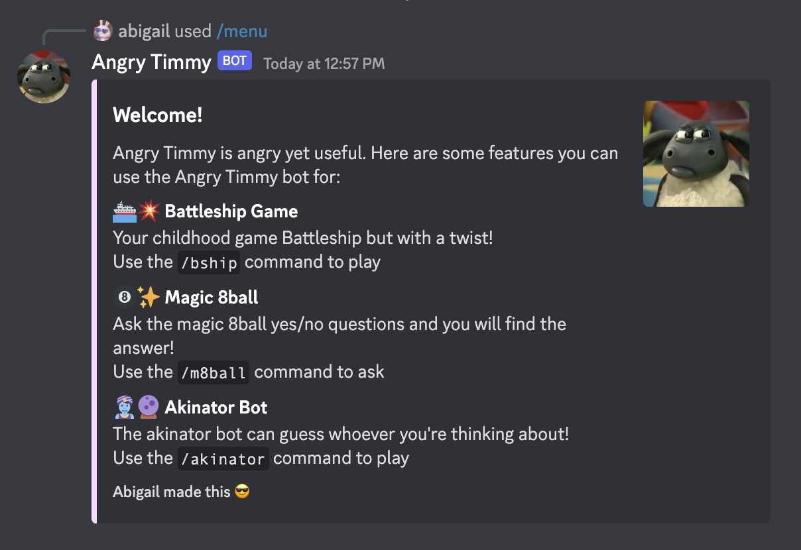
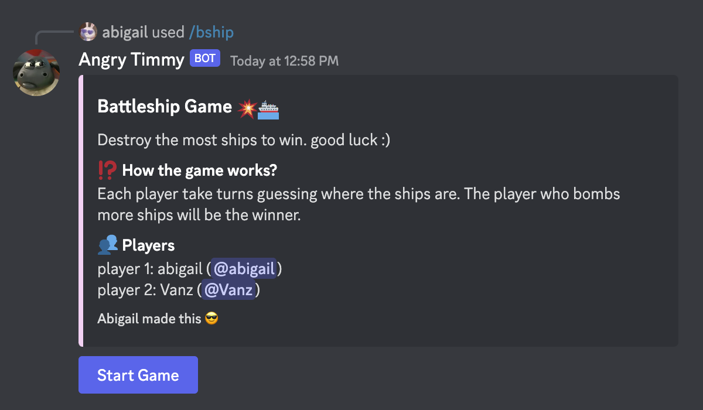
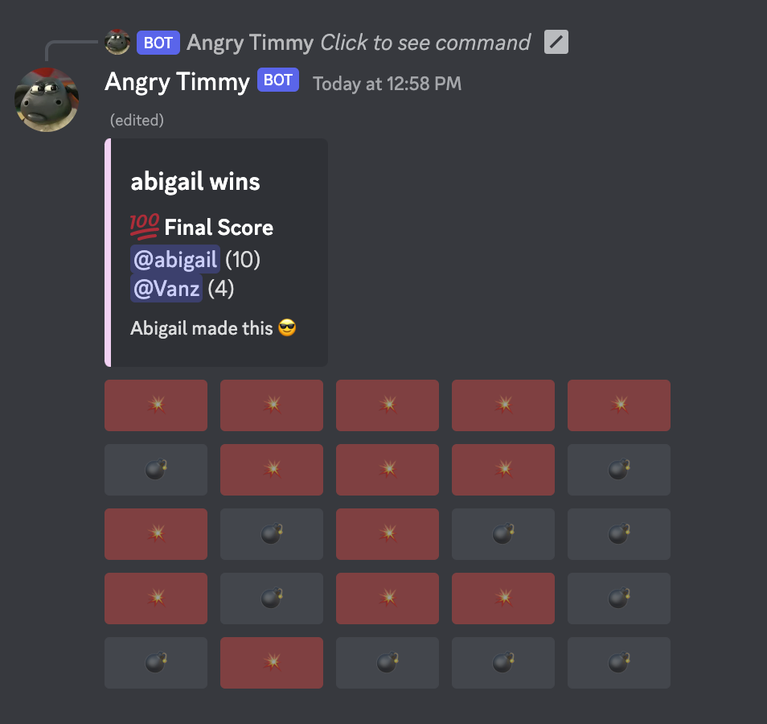
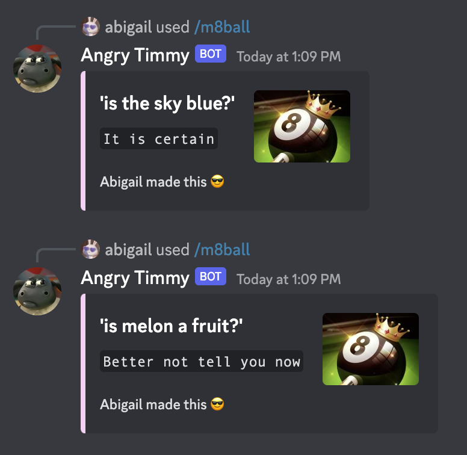
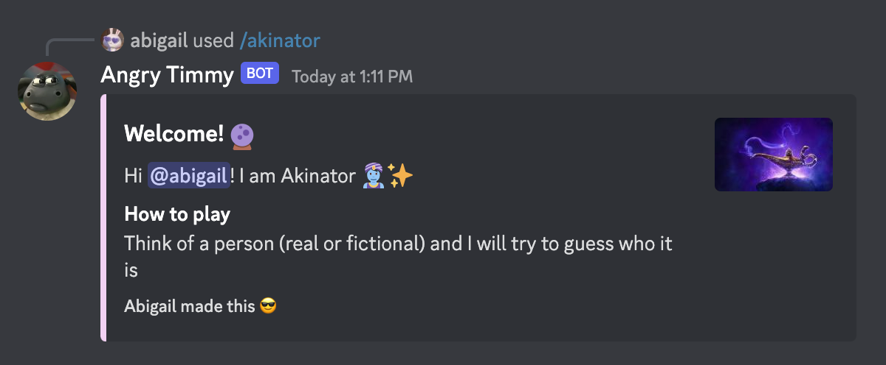
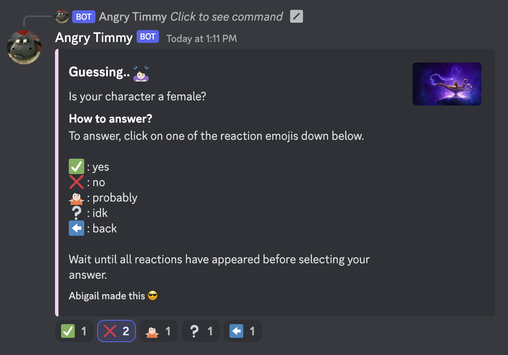
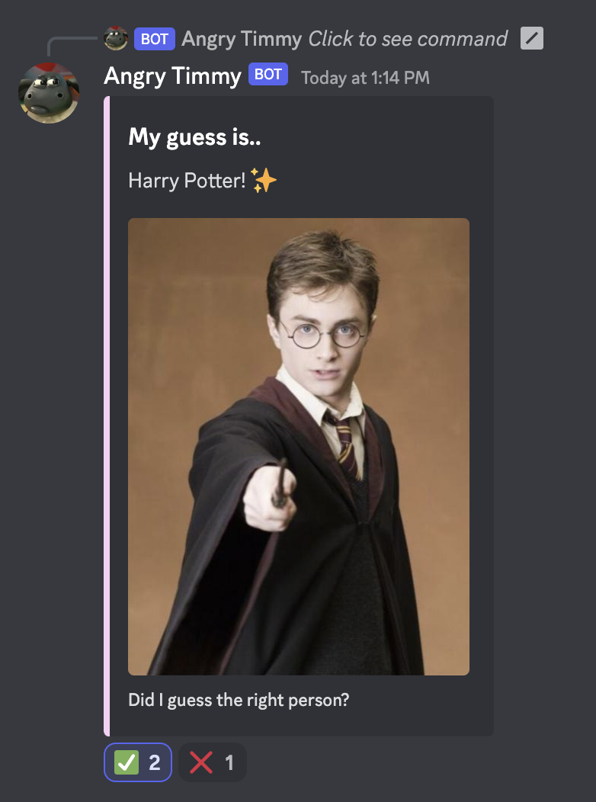
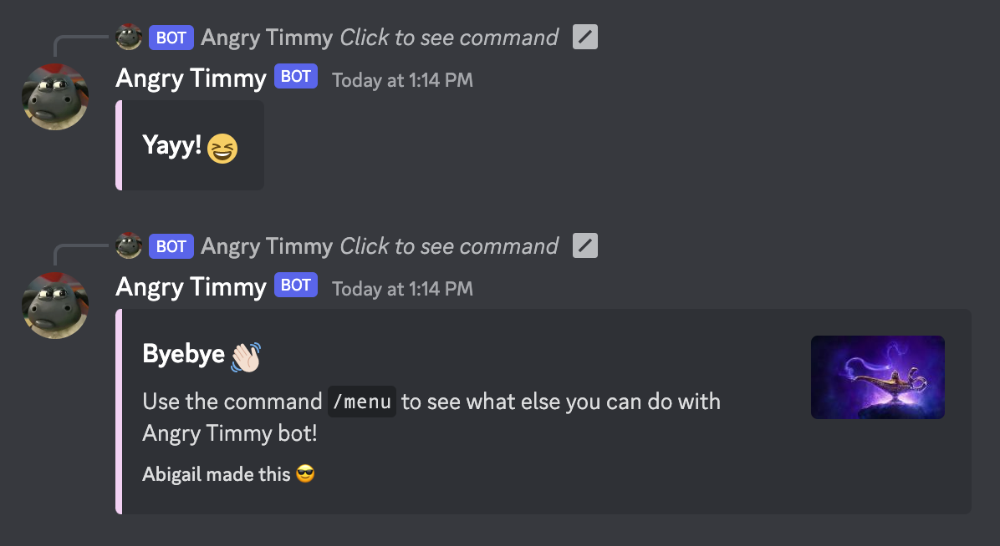

# Angry Timmy Discord Bot
A discord bot I made for Algorithm and Programming Final Project. 

## Features ( ๑>ᴗ<๑ ) ✧:･ﾟ✧


## How to use 
1. Download the zip folder containing all of the files of this repository
2. Open the folder in your chosen IDE
3. Install dependencies by typing this command into your terminal

```sh
pip install -r requirements.txt
```
4. Input your server ID(s) into the `guilds` variable

```PY
guilds = [] # list server guild id(s) here
```

5. Add your bot's token into the 
```py
bot.run("token here")
```
6. Run the code and your bot should be activated in a bit

## 💾 Demonstration video link
https://www.youtube.com/watch?v=WhTkVUuUCEI

## Screenshots of the bot in action 

### Battleship game ⛴️💥



### Magic 8ball 🎱✨


### Akinator bot 🧞🔮




